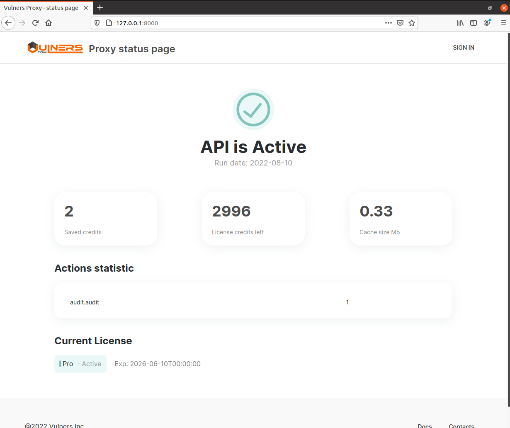

# Intro
When you have many Vulners agents running on similar hosts, they can send lots of identical requests to Vulners. This also applies to using API to control similar machines. To stop wasting Vulners credits you can use Vulners proxy.

Vulners proxy is a caching proxy that allows optimizing the number of API-requests sent by your infrastructure to Vulners database, saving your Vulners credits. To start using Vulners proxy, redirect all your agents and API-requests to it. Vulners proxy processes all requests and caches the result, reducing redundant requests to Vulners database.

# Installation

## Debian based OS
First add vulners.com pubkey:
```
wget -O- https://repo.vulners.com/pubkey.txt | apt-key add -
```

After this create file */etc/apt/sources.list.d/vulners.list*
```
deb http://repo.vulners.com/debian focal main
```
And install package
```
apt-get update && apt-get install vulners-proxy
```

## Source code
You could clone source code of package and perform run server using python. 
* Install python3 and python3-pip
* Clone source code from repository
* Install requirements.txt with ```pip install -U -r requirements.txt```
* You can run service manually with command 
```uvicorn main:app --host 0.0.0.0 --port 8000```
* Or you can config systemd to run server as a service. Here is an example configuration
```$ cat /etc/systemd/system/vulners-proxy.service
[Unit]
Description=Vulners proxy
After=network.target

[Service]
WorkingDirectory=/var/lib/vulners-proxy
User=nobody
PermissionsStartOnly=true
#ExecStartPre=/usr/bin/pip install -U -r requirements.txt
ExecStart=/usr/local/bin/uvicorn main:app --host 0.0.0.0 --port 8000

[Install]
WantedBy=multi-user.target
```

# Proxy configuration
Proxy configuration is located in file */etc/vulners_proxy/vulners_proxy.conf*. Here is an example.
```
[logging]
LogFile = /var/log/vulners_proxy/vulners_proxy.log
LogLevel = ERROR

[app]
Workers = 1
Port = 8000
Host = 0.0.0.0
Reload = False
ApiCacheTimeout = 3600   # seconds
CacheTimeout = 10800     # seconds
CacheDir = /tmp/vulners-proxy.cache/
StatisticCacheDir = /tmp/vulners-proxy.statistic.cache/
Secret = secret_for_encrypt_ip_fqdn     # 32 symbols required length
EnableEncryption = 0                    # 0 - disabled, 1 - enabled

[vulners]
ApiKey = YOUR_SECRET
```
You can set logging settings, proxy server host and port, cashe directory and timeout.

Also proxy can encrypt IP address and FQDN of your agents before forwarding them to Vulners. To enable this feature set secret key and EnableEncryption flag to 1.

**NB.** While encryption is enabled you won't be able to see readable agent identificators in Linux Scanner dashboard, only hashes. If you want to get nice reports you should config custom dashboard on your side of proxy. For example, you can use Security Dojo with Vulners plugin.


# Proxy start
Run service
```
systemctl daemon-reload; systemctl enable vulners-proxy; systemctl start vulners-proxy
```

# Agent configuration
Now you should config your Vulners Agents and redirect traffic to proxy. Agent configuration is located in file */etc/vulners/vulners_agent.conf*.

Add proxy host address at the end.

```
[DEFAULT]
api_key = YOUR_SECRET
vulners_host = http://<proxy_vm_ip_address_or_fqdn>:8000
```

# API configuration
If you want to redirect your API requests to proxy, use constructor with server_url parameter like this:
```
import vulners

vulners_api = vulners.VulnersApi(api_key="YOUR_SECRET", server_url="http://<proxy_vm_ip_address_or_fqdn>:8000")

# Plain text software + version example for Ngnix 1.4
sw_results = vulners_api.get_software_vulnerabilities("nginx", "1.4")
sw_exploit_list = sw_results["exploit"]
```

# Proxy UI
Vulners Proxy has a simple web GUI. With GUI you can control proxy status, expenses and some statistics. To login you should set your API key in proxy configuration. 
To generate API key log in to vulners.com, go to [userinfo space] (https://vulners.com/userinfo). Then choose "apikey" section.
Choose "scan" in scope menu and click "Generate new key". You will get an api-key, which looks like this:
**RGB9YPJG7CFAXP35PMDVYFFJPGZ9ZIRO1VGO9K9269B0K86K6XQQQR32O6007NUK**

To get GUI, open proxy host in browser



# Docker
Finally, you can simply run Docker image. 

```
docker run vulners/proxy
```

Or you can forward default port and set API key, so you could use UI

```
docker run -p 80:8000 -e apiKey=YOUR_SECRET vulners/proxy
```

To set configuration, mount config file to your container

```
docker run --rm -p 8000:8000 -v $(pwd)/example.conf:/etc/vulners_proxy/vulners_proxy.conf vulners/proxy:latest
```

